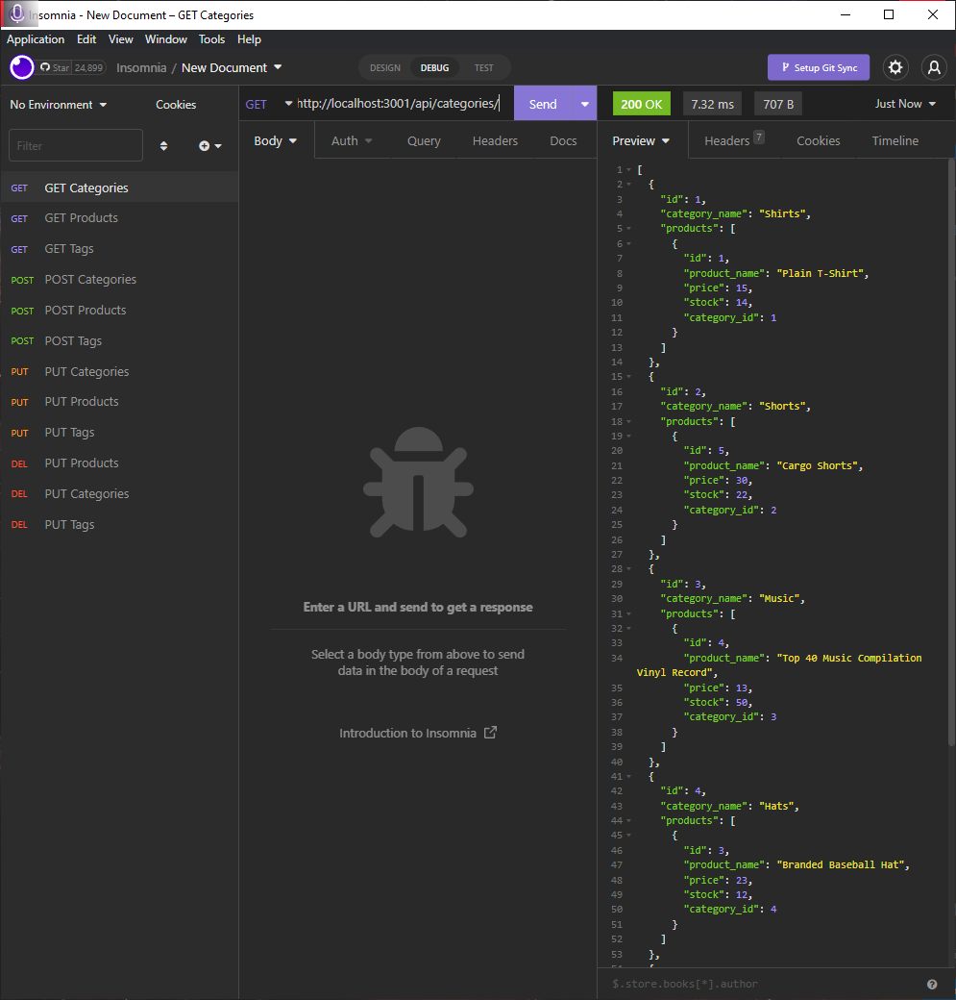
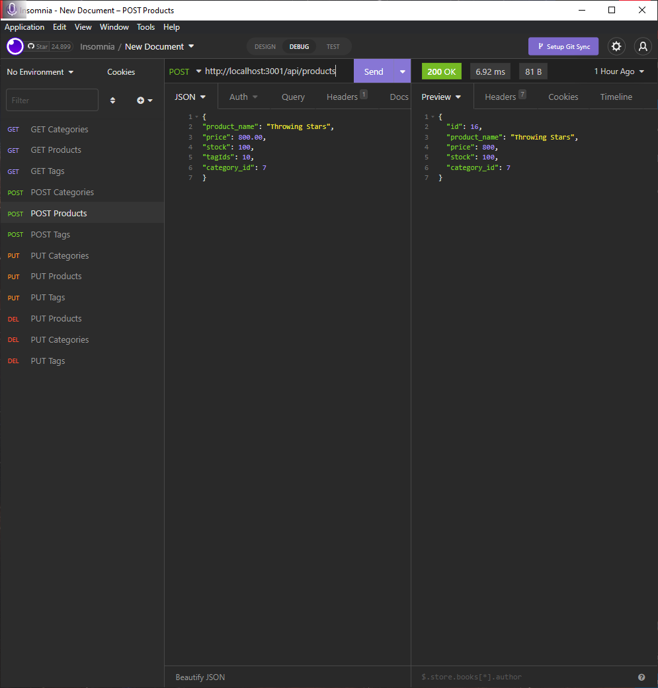
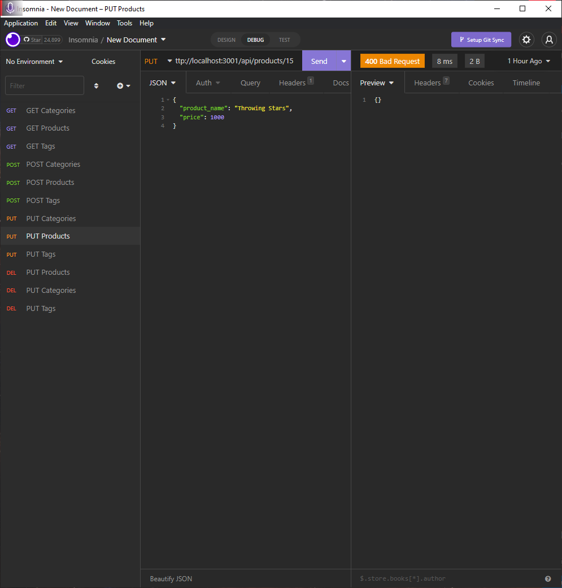
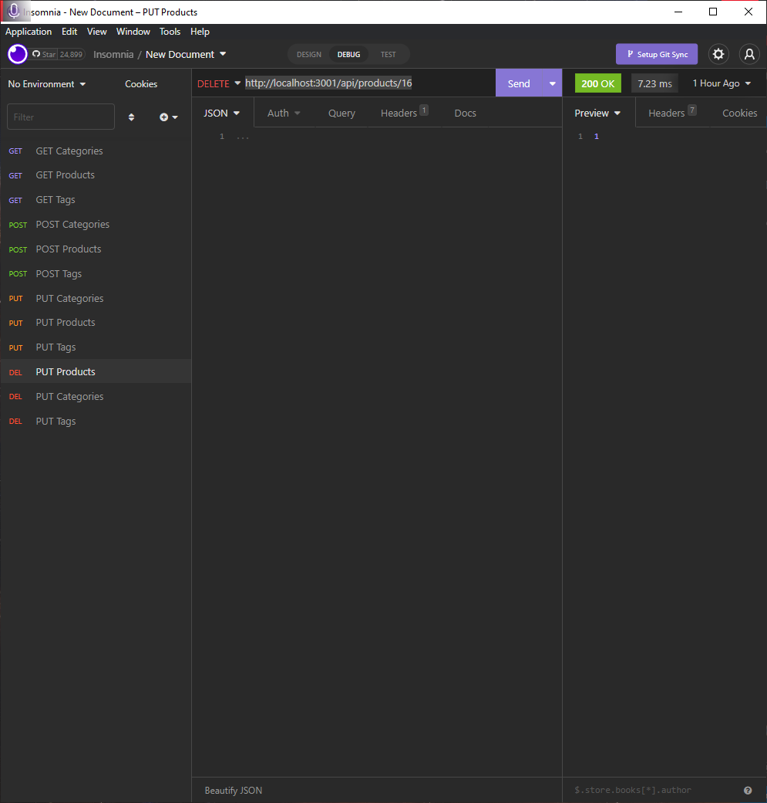

# Sequelize E-commerce Backend

## Description
This application uses Express.js, Sequelize and MySql to create an e-commerce backend where users can look up products, product categories, tags for said products and the id's for all of the above. Using queries for id a user can search, update or delete from the database. Configuring the API routes was the bulk of this applications work, as we were given starter code for some routes but not all. Similarly all of the models had to be created for this application to work properly.

## Table of Contents
- [Installation](#installation)
- [Link to Walkthrough](#Link-to-Walkthrough)
- [Usage/Examples](#usage)
- [Credits](#credits)
- [License](#license)

## Installation

The required installs for this application are listed in the package dependencies, so running `npm i` to install these packages is necessary.
Seeding the database with `node seeds` and configuring an `.env` file are necessary for this application to work. 

Also since these routes only exist locally one would need to use `Insomnia` to view the routes and their associated data.

## Link to Walkthrough
- [Link to Walkthrough](https://drive.google.com/file/d/1zPm08hLzb4FY_0NYoFzSKssDZzkinOHy/view?usp=sharing)

## Usage/Examples
Using Insomnia a user can GET products, categories and tags. One can also use an /:id param to search for a specific item.

Post routes work but require data to be inputted in a JSON req properly.

Users can also update tables based of an id query.

Finally users can delete categories, products and tags using an id param too.

## Credits
Most of this assignment was pretty straight forward after just completing our second project using Sequelize, MySQL and Express.

However I did refer to Sequelize's documentation for proper associations, including `through` options and `where` options.

* [Sequelize](https://sequelize.org/docs/v6/advanced-association-concepts/advanced-many-to-many/)

* [Bezkoder](https://www.bezkoder.com/sequelize-associate-many-to-many/)

## License
MIT License
 
Copyright (c) [2022] [Sky Hamilton Texier]
 
Permission is hereby granted, free of charge, to any person obtaining a copy
of this software and associated documentation files (the "Software"), to deal
in the Software without restriction, including without limitation the rights
to use, copy, modify, merge, publish, distribute, sublicense, and/or sell
copies of the Software, and to permit persons to whom the Software is
furnished to do so, subject to the following conditions:
 
The above copyright notice and this permission notice shall be included in all
copies or substantial portions of the Software.
 
THE SOFTWARE IS PROVIDED "AS IS", WITHOUT WARRANTY OF ANY KIND, EXPRESS OR
IMPLIED, INCLUDING BUT NOT LIMITED TO THE WARRANTIES OF MERCHANTABILITY,
FITNESS FOR A PARTICULAR PURPOSE AND NONINFRINGEMENT. IN NO EVENT SHALL THE
AUTHORS OR COPYRIGHT HOLDERS BE LIABLE FOR ANY CLAIM, DAMAGES OR OTHER
LIABILITY, WHETHER IN AN ACTION OF CONTRACT, TORT OR OTHERWISE, ARISING FROM,
OUT OF OR IN CONNECTION WITH THE SOFTWARE OR THE USE OR OTHER DEALINGS IN THE
SOFTWARE.

